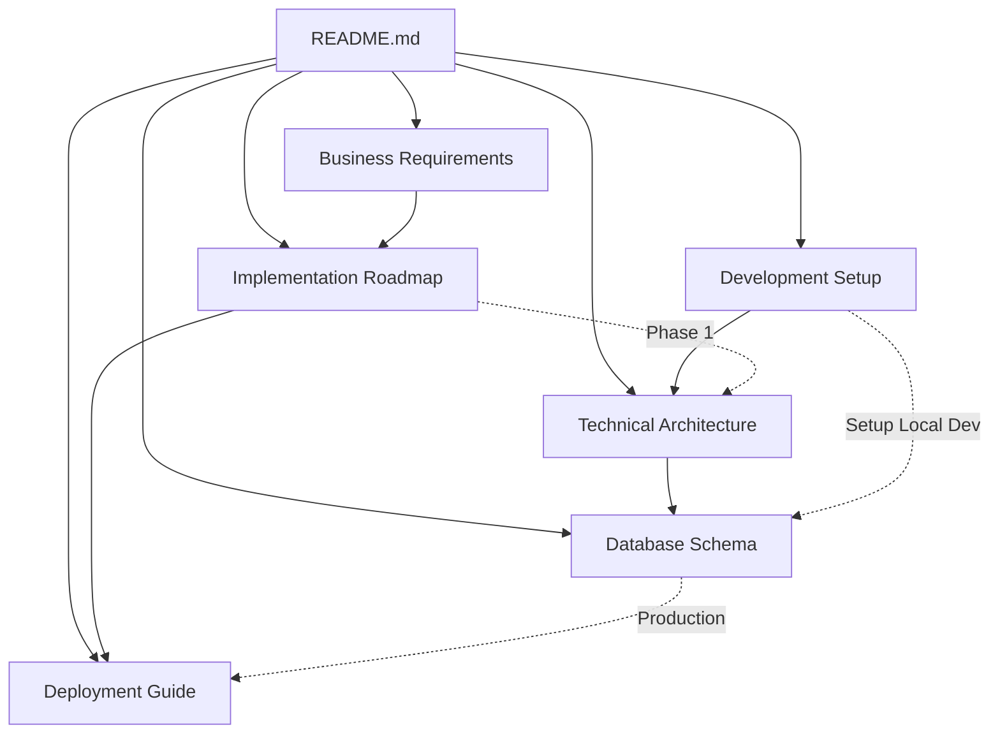

# AI Copilot Vibe - Project Documentation

## **Project Overview**

AI Copilot Vibe is a GitHub Enterprise Email SaaS that provides developers worldwide with GitHub Copilot access through enterprise email addresses. Users pay a monthly subscription ($19.99) and receive their enterprise email credentials within 24 hours.

---

## **📚 Documentation Index**

### **🚀 Getting Started**
- **[Development Setup Guide](./development-setup.md)** - Complete setup instructions for local development
- **[Technical Architecture](./technical-architecture.md)** - Tech stack, file structure, and system design

### **📋 Planning & Requirements**
- **[Business Requirements](./business-requirements.md)** - Product specs, user flows, and success metrics
- **[Implementation Roadmap](./implementation-roadmap.md)** - 8-week phased development plan

### **🔧 Technical Specifications**
- **[Database Schema](./database-schema.md)** - Complete database design and Drizzle ORM setup
- **[Deployment Guide](./deployment-guide.md)** - Production infrastructure and CI/CD pipeline

---

## **🛠️ Current Implementation Status**

### **✅ Already Implemented**
- **Next.js 15.3.1** with App Router and TypeScript
- **Tailwind CSS v4.1.5** with extensive Radix UI components
- **Development Tools**: Jest, Playwright, Storybook, ESLint, Prettier
- **Environment Validation**: Zod schemas and @t3-oss/env-nextjs

### **❌ Missing Critical Components**
- **Authentication**: better-auth for users and admins
- **Database**: Drizzle ORM + PostgreSQL connection and schema  
- **Payments**: Polar.sh integration and webhooks
- **Email**: Resend service and templates
- **Analytics**: Umami and Sentry monitoring

---

## **📋 Quick Start Checklist**

### **For New Developers**
1. **✅ Read [Development Setup Guide](./development-setup.md)**
2. **✅ Setup local environment and database**
3. **✅ Review [Technical Architecture](./technical-architecture.md)**
4. **✅ Check [Implementation Roadmap](./implementation-roadmap.md) Phase 1**
5. **🚀 Start development with foundation setup**

### **For Product Managers**
1. **✅ Review [Business Requirements](./business-requirements.md)**
2. **✅ Understand user flows and success metrics**
3. **✅ Check [Implementation Roadmap](./implementation-roadmap.md) timeline**
4. **✅ Review deployment strategy in [Deployment Guide](./deployment-guide.md)**

### **For DevOps/Infrastructure**
1. **✅ Review [Deployment Guide](./deployment-guide.md)**
2. **✅ Setup Alibaba Cloud RDS PostgreSQL**
3. **✅ Configure Vercel deployment pipeline**
4. **✅ Setup monitoring and security**

---

## **🏗️ Architecture Overview**

```
┌─────────────────┐    ┌──────────────────┐    ┌─────────────────┐
│   Frontend      │    │   Database       │    │  External APIs  │
│   (Vercel)      │◄──►│  (Alibaba RDS)   │    │                 │
│                 │    │                  │    │                 │
│ • Next.js 15    │    │ • PostgreSQL     │    │ • Polar.sh      │
│ • React 19      │    │ • Drizzle ORM    │    │ • Resend        │
│ • Tailwind CSS  │    │ • 6 Tables       │    │ • Umami         │
│ • shadcn/ui     │    │ • Migrations     │    │ • Sentry        │
└─────────────────┘    └──────────────────┘    └─────────────────┘
```

---

## **📊 Implementation Progress**

| Phase | Status | Duration | Key Features |
|-------|---------|----------|--------------|
| **Phase 1: Foundation** | 🔄 Ready to Start | Weeks 1-2 | Auth, Database, Payments, Basic UI |
| **Phase 2: Admin System** | ⏳ Planned | Weeks 3-4 | Order Management, User Admin, Security |
| **Phase 3: Content Management** | ⏳ Planned | Weeks 5-6 | Dynamic Content, SEO, A/B Testing |
| **Phase 4: Production** | ⏳ Planned | Weeks 7-8 | Analytics, Monitoring, Launch |

---

## **🚦 Priority Development Order**

### **Immediate (Week 1)**
1. **Database Setup** - Drizzle ORM + PostgreSQL schema
2. **Authentication** - better-auth for users and admins  
3. **Basic UI** - shadcn/ui setup and core pages

### **Next (Week 2)**
4. **Payment System** - Polar.sh integration and webhooks
5. **Email System** - Resend templates and delivery
6. **Core API Routes** - User registration, login, dashboard

### **Then (Weeks 3-4)**
7. **Admin Dashboard** - Order management interface
8. **User Management** - Admin tools and activity logging
9. **Security Hardening** - Rate limiting, validation, CSRF

---

## **📖 Key Resources**

### **External Documentation**
- [Next.js 15 Documentation](https://nextjs.org/docs)
- [Drizzle ORM Guide](https://orm.drizzle.team/docs/overview)
- [better-auth Documentation](https://better-auth.com/docs)
- [Polar.sh API Reference](https://docs.polar.sh/)
- [Resend API Documentation](https://resend.com/docs)

### **Development Commands**
```bash
# Start development
pnpm run dev

# Database operations  
pnpm run db:migrate
pnpm run db:seed
pnpm run db:studio

# Testing
pnpm run test
pnpm run test:e2e

# Code quality
pnpm run lint
pnpm run type-check
```

---

## **🔗 Document Relationships**



---

## **📞 Support & Contact**

- **Repository Issues**: Create issues for bugs and feature requests
- **Development Questions**: Check troubleshooting in [Development Setup](./development-setup.md)
- **Architecture Questions**: Review [Technical Architecture](./technical-architecture.md)
- **Deployment Issues**: See [Deployment Guide](./deployment-guide.md)

---

**Last Updated**: January 2025  
**Documentation Version**: 1.0  
**Project Status**: Foundation Phase Ready