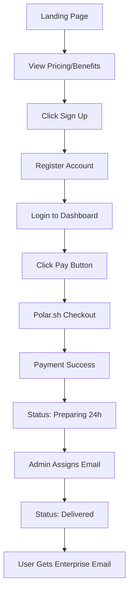
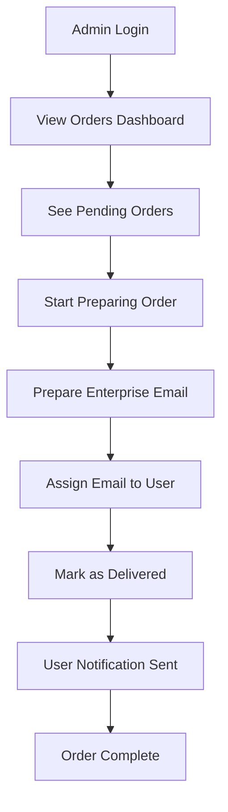

# Business Requirements & Product Specification

## **Product Overview**

### **Business Model**
- **Product**: Selling GitHub enterprise email addresses that provide GitHub Copilot access
- **Target Market**: Global VSCode developers who want GitHub Copilot functionality
- **Pricing Strategy**: Single monthly subscription tier at $19.99 (Early Bird pricing)
- **Fulfillment Process**: Payment → 24-hour manual email preparation → Email delivery to customer
- **Market Scope**: Global reach, no geographic restrictions, no free trials

### **Value Proposition**
- Instant access to GitHub Copilot through enterprise email
- 24-hour delivery guarantee
- Monthly subscription with no long-term commitment
- Works with any VSCode setup globally

## **Core User Flows**

### **Customer Journey**

### **Admin Workflow**

## **Key Features**

### **User Features**
- **Landing Page**: Dynamic content management, pricing display, benefits showcase
- **Authentication**: Email/password registration and login
- **User Dashboard**: Order status, payment history, enterprise email credentials
- **Payment System**: Polar.sh integration with credit card and PayPal support
- **Email Notifications**: Welcome, order confirmation, delivery notifications

### **Admin Features**
- **Admin Authentication**: Separate admin login system
- **Order Management**: View, assign, update, and track all orders
- **User Management**: View user accounts, subscription status, payment history
- **Content Management**: Update landing page content, pricing, FAQs
- **Analytics Dashboard**: Order metrics, conversion tracking, user analytics

## **Success Metrics**
- **Conversion Rate**: Landing page to paid subscription
- **Order Fulfillment**: 24-hour delivery SLA compliance
- **User Retention**: Monthly subscription renewal rate
- **Geographic Reach**: Global market penetration
- **Revenue Growth**: Monthly recurring revenue tracking

## **Compliance & Legal**
- **Data Protection**: GDPR compliance for EU users
- **Payment Security**: PCI DSS compliance through Polar.sh
- **Terms of Service**: Clear subscription terms and refund policy
- **Privacy Policy**: Transparent data handling practices